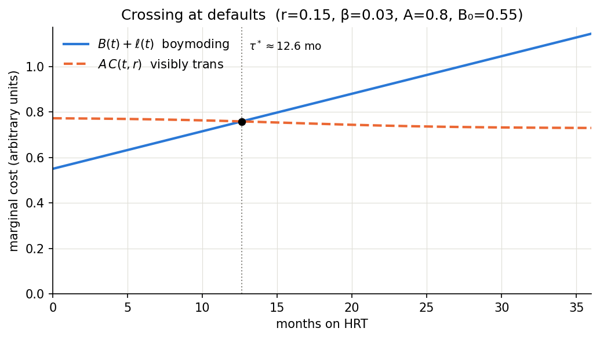

# transition-timing

An optimal-stopping model for the timing of social transition. The decision-maker balances an *increasing* marginal cost of continuing to boymode against a *decreasing* marginal cost of being out and read as trans. The paper derives the optimum, its sensitivities, and why it isn't a single number.

**Paper:** [`docs/model.pdf`](docs/model.pdf) 

> GitHub strips scripts from READMEs, so the chart can't run here. The static version is below; the live one with sliders is `docs/index.html`.



## The model in four lines

Time `t` is months on HRT. Switch at `τ`.

```
C(t, r)  = 1 − Π_i (1 − c_i)                clock probability; cues combine as independent failures
B(t)     = B₀ (1 + β t)                     boymoding cost, increasing
ℓ(t)     = ℓ₀ exp(−λ t)                     life-lost rate, irreversible, front-loaded
J(τ)     = ∫₀^τ [B + ℓ] dt + ∫_τ^T A·C dt + S(τ)
```

Only the face cue depends on `t`. Hair, brow and voice cues depend on a preparation fraction `r ∈ [0,1]` and nothing else. `A` is context hostility. `S` has step discontinuities at the dates new social contexts form.

First-order condition between steps: `B(τ*) + ℓ(τ*) = A·C(τ*, r)`.

## What falls out

| Result | Where |
|---|---|
| `∂τ*/∂r < 0` and its magnitude grows with `r` prep work has increasing returns | §5, fig. `prep_sweep` |
| `∂τ*/∂β ≈ −377` mo/unit the growth rate of boymoding pain dominates everything | §5, table 1 |
| Any weighting that respects irreversibility (`ℓ₀ > 0`) collapses `τ*` toward zero | §5, fig. `life_lost` |
| A step in `S` at a context-formation date relocates the optimum to just before the step whenever `Δ > ∫(−g) dt`, which is small | §4, fig. `step` |
| `τ*` is a vector at one entry per context, not a scalar | §7, fig. `contexts` |
| Self-perception bias barely matters while voice/hair dominate `C`, then becomes first-order once they're handled (`∂²τ*/∂c_face ∂r > 0`) | §6, fig. `bias_by_prep` |

The model has **no predictive power over the number**. Every parameter is unobservable. What survives is the sign of every partial derivative, and those are robust.

## Use

```bash
pip install -e ".[dev]"
pytest                          # 25 tests: limits, derivative identities, step logic, sensitivity signs
python scripts/make_figures.py  # regenerates figures/*.png and *.pdf
```

```python
from transition_timing import Params, Step, optimum, sensitivity, per_context_optima

p = Params()                                   # defaults reproduce the chart above
optimum(p)                                     # (12.63, 25.54)  → τ* in months, J at optimum
optimum(p.with_(r=0.8))                        # (5.79, ...)     → after prep work
optimum(p.with_(l0=0.2))                       # (1.99, ...)     → with life-lost weighting
optimum(p.with_(steps=(Step(1.0, 2.0),)))      # (1.0, ...)      → step at month 1 wins

sensitivity(p)                                 # analytic ∂τ*/∂θ for every parameter

per_context_optima([
    ("new context",  0.45, (Step(1.0, 1.5),)),
    ("general",      0.80, ()),
    ("home",         1.20, ()),
], p)                                          # {'new context': 0.0, 'general': 12.63, 'home': 33.06}
```

## Caveat

This is a toy. It's deterministic, it treats transition as a single switch per context, and it models only the cost of being clocked, not the benefit of being out. See §9 of the paper. Don't actually base your transition in this bs or the brainworms WILL eat you alive. 
